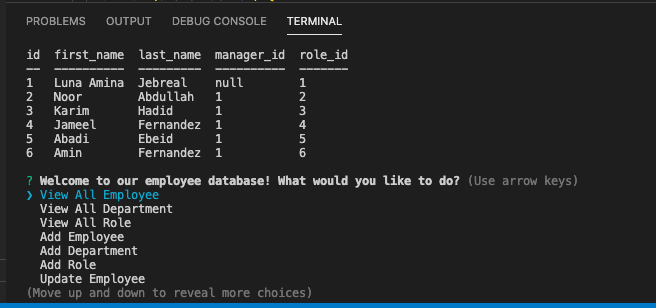
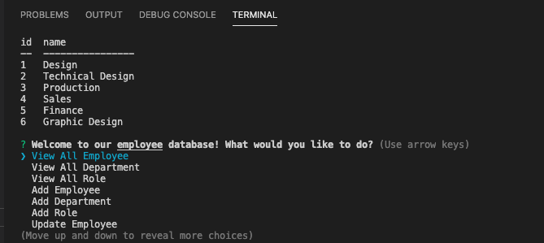
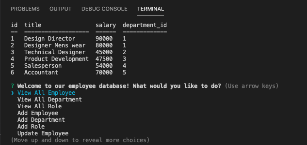
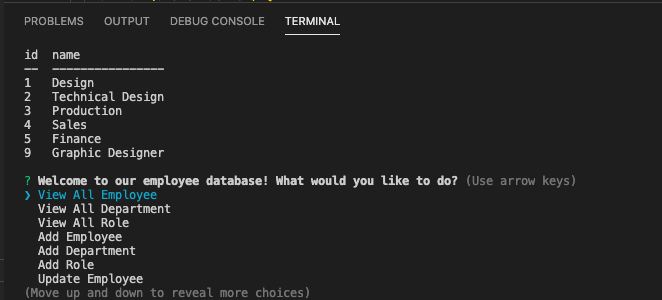
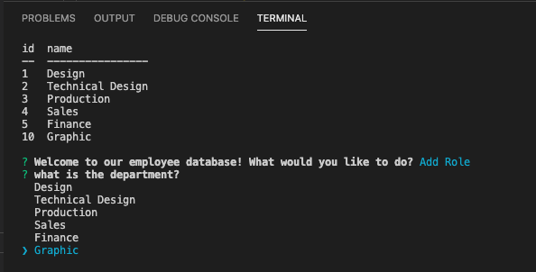
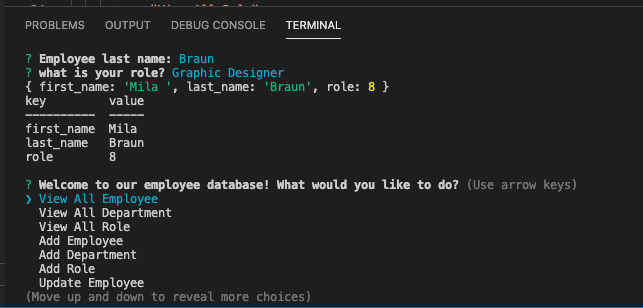

 # Employee-Tracker
 
  ## Table of Contents
  * [Description](#description)
  * [Installation](#installation)
  * [Usage](#usage)
  * [License](#license)
  * [Contributors](#contributors)
  * [Test](#test)
  * [Questions](#questions)
  
  ## Description
  This app is to manage a company's employee using MySQL

  As a business owner   
  I want to be able to view and manage the departments, roles, and employees in my company   
  So that I can organize and plan my business    

  ## Installation
  Need to install the following;   
  -npm install   
  -npm install inquirer   
  -npm install msql   
  -npm install console.table    
  Then using your terminal to execute app.js   

  ## Usage
  Open your terminal and change to correspondiung directory.   
  Run "node app.js" and you will be prompted  with option.    

  ## Lincense
  

  ## Contributors
  n/a

  ## Test
 * Add departments, roles, employees   

  * View departments, roles, employees   

  * Update employee roles  
  
  ## Questions

  Contact me:   
  Github: https://github.com/Wendyf02  
  Email: cammomila444@gmail.com   
  video Link:

Screenshot 

    View All Employee   

    View All Dept   

    View All Role  

    Add Dept   

    Add Role   

    Add Employee  

